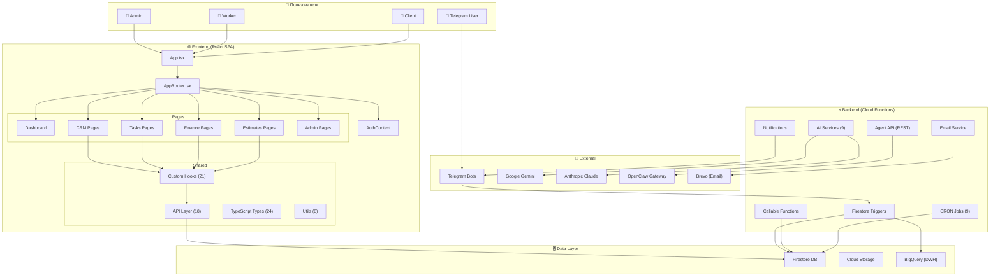
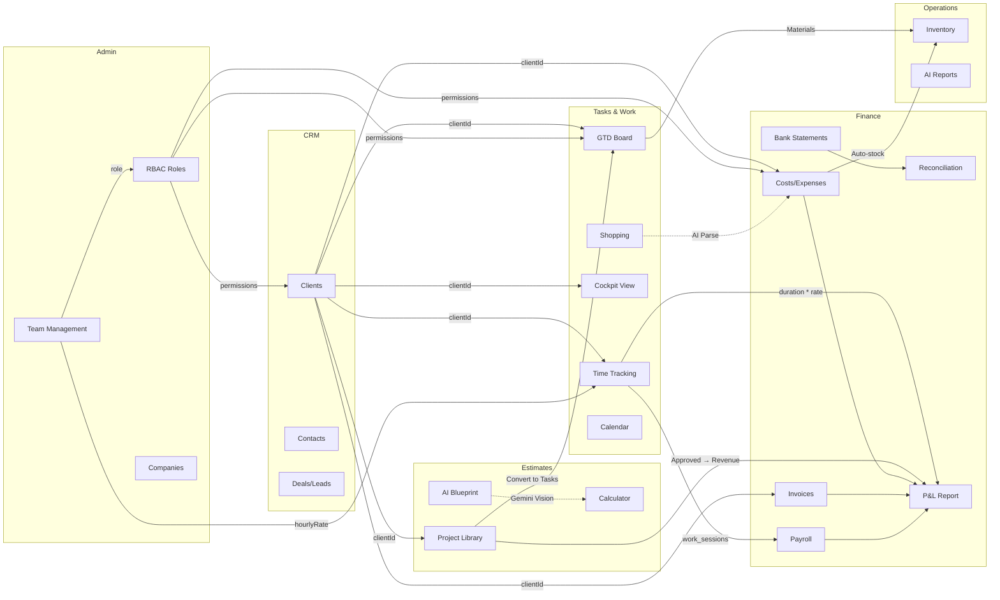
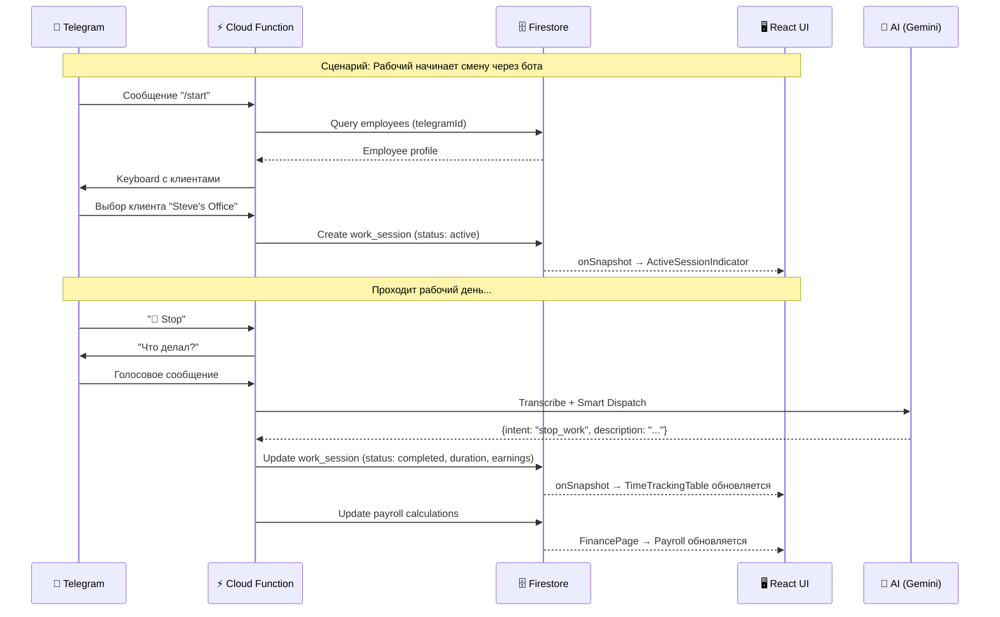
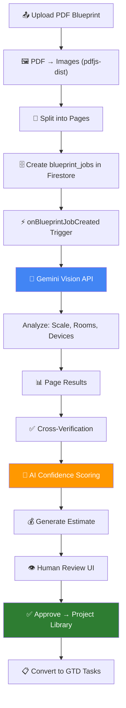
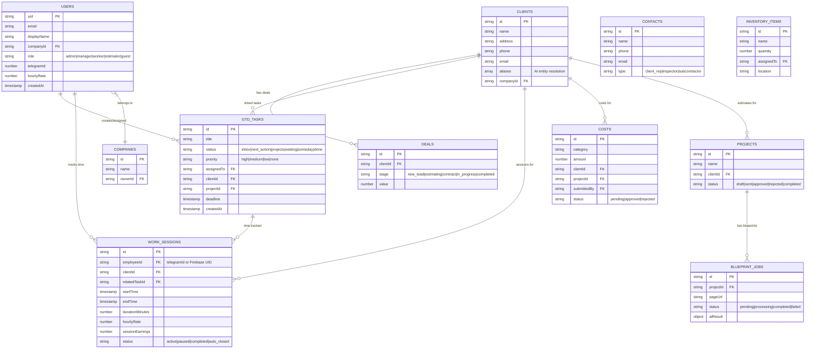
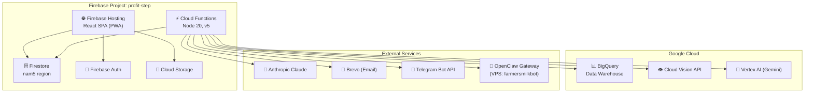

# 🏗️ Profit Step — Архитектурная Диаграмма

> Все связи между модулями, потоки данных и зависимости

---

## 1. Высокоуровневая архитектура

---

## 2. Связи между модулями

---

## 3. Поток данных: Telegram → Firestore → UI

---

## 4. AI Pipeline: Blueprint Estimator

---

## 5. Firestore Collections Map

---

## 6. Архитектура деплоя

---

## 7. Сводная таблица зависимостей

### Frontend зависимости
| Пакет | Версия | Назначение |
|-------|--------|-----------|
| react | 19.2 | UI фреймворк |
| @mui/material | 7.3 | UI компоненты |
| react-router-dom | 7.9 | Маршрутизация |
| firebase | 12.4 | Firebase SDK |
| recharts | 3.5 | Графики |
| d3 | 7.9 | Визуализации |
| leaflet | 1.9 | Карты |
| jspdf | 4.1 | PDF генерация |
| pdfjs-dist | 5.4 | PDF рендеринг |
| xlsx | 0.18 | Excel экспорт |
| gantt-task-react | 0.3 | Диаграмма Ганта |
| @hello-pangea/dnd | 18.0 | Drag & Drop |
| @dnd-kit/* | 6-10 | Drag & Drop (альтернатива) |
| react-hook-form | 7.66 | Формы |

### Backend зависимости
| Пакет | Версия | Назначение |
|-------|--------|-----------|
| firebase-admin | 12.0 | Firebase Admin SDK |
| firebase-functions | 5.0 | Cloud Functions |
| @google/generative-ai | 0.24 | Gemini API |
| @google-cloud/vertexai | 1.10 | Vertex AI |
| @anthropic-ai/sdk | 0.74 | Claude API |
| openai | 6.25 | OpenAI API |
| @google-cloud/bigquery | 7.9 | BigQuery |
| @google-cloud/vision | 5.3 | Vision OCR |
| sharp | 0.34 | Обработка изображений |
| fuse.js | 7.1 | Fuzzy search |
| zod | 3.25 | Валидация схем |
| nodemailer | 7.0 | Email |
| cheerio | 1.2 | HTML парсинг |
| axios | 1.13 | HTTP клиент |
