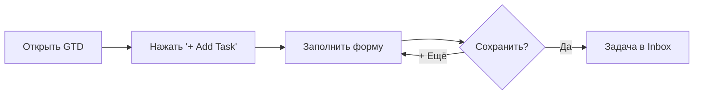
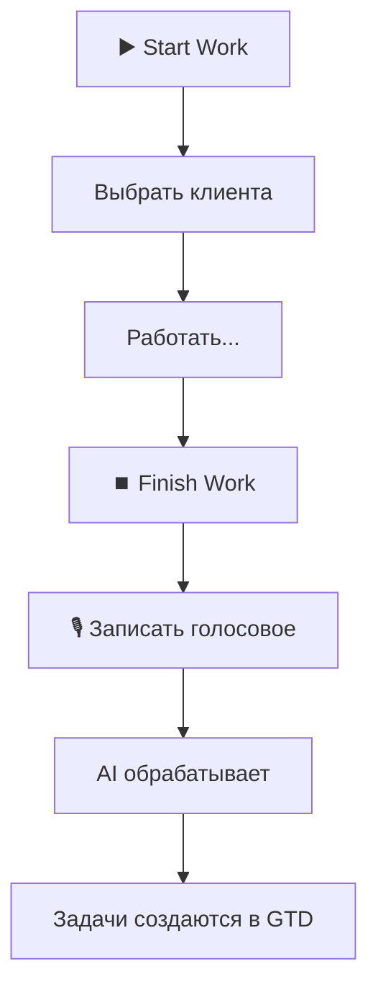

# 📋 Схема добавления задач в Profit Step

Система поддерживает два способа создания задач:
1. **Через Web UI** (GTD доска)
2. **Через Telegram бота** (голосовые отчёты)

---

## 🌐 Способ 1: Web UI — GTD Канбан-доска

**URL:** https://profit-step.web.app/crm/gtd

### Как открыть форму



### Поля формы Quick Add

| Поле | Тип | Описание |
|------|-----|----------|
| **Клиент** | Автокомплит | Выбор из базы клиентов |
| **Категория** | Кнопки | Тип действия (см. ниже) |
| **Описание** | Текст | Подробности задачи |
| **Требует просчёт** | Toggle | Отправить в колонку Estimate |

### Категории задач

```
📦 СНАБЖЕНИЕ
   ├─ Куп      (Купить)
   ├─ Прив     (Привезти)
   ├─ Забр     (Забрать)
   └─ Перем    (Переместить)

🔍 КОНТРОЛЬ
   ├─ Пров     (Проверить)
   ├─ Замер    (Замерить)
   └─ Фото     (Сфотографировать)

🔧 ИСПОЛНЕНИЕ
   ├─ Почин    (Починить)
   ├─ Устан    (Установить)
   └─ Обсл     (Обслужить)

💬 КОММУНИКАЦИЯ
   ├─ Встр     (Встретить)
   └─ Подп     (Подписать)
```

### Колонки доски GTD

```
┌─────────────┬───────────────┬──────────────┬─────────────┐
│   INBOX     │ NEXT ACTIONS  │  PROJECTS    │ WAITING FOR │
│  Входящие   │ К выполнению  │   Проекты    │  Ожидание   │
└─────────────┴───────────────┴──────────────┴─────────────┘
┌─────────────┬───────────────┬──────────────┐
│  ESTIMATE   │SOMEDAY/MAYBE  │    DONE      │
│  Просчёт    │  Когда-нибудь │   Готово     │
└─────────────┴───────────────┴──────────────┘
```

### Фильтры и режимы

- **Мои / Все** — показать только свои или все задачи
- **По клиенту** — фильтр по выбранному клиенту
- **По исполнителю** — фильтр по назначенному
- **По дате** — фильтр по дедлайну

---

## 🤖 Способ 2: Telegram Бот — Голосовые отчёты

**Бот:** @ProfitStepWorkerBot

### Как работает



### AI распознаёт задачи автоматически

**Пример голосового:**
> "Сегодня закончил плитку в ванной. Завтра нужно купить затирку и закончить межкомнатные двери."

**AI создаст:**
1. ✅ Купить затирку
2. ✅ Закончить межкомнатные двери

### Что распознаёт AI

| Элемент | Как указать |
|---------|-------------|
| **Название** | Просто назови задачу |
| **Дата** | "Завтра", "В понедельник", "15 числа" |
| **Приоритет** | "Срочно", "Важно", "Когда будет время" |
| **Клиент** | Привязывается к текущей сессии |

### Куда попадают задачи

Все задачи из бота создаются:
- **Колонка:** Inbox
- **Метка:** @bot
- **Автор:** Работник, записавший голосовое
- **Клиент:** Клиент из текущей сессии

---

## 🔄 Синхронизация

```
     TELEGRAM BOT                      WEB UI
         │                               │
         │  ┌─────────────────────┐      │
         └──▶  FIRESTORE gtd_tasks ◀─────┘
             └─────────────────────┘
                       │
                       ▼
              Реал-тайм синхро
              (обе стороны видят
               одни и те же задачи)
```

---

## 📱 Команды бота

| Команда | Описание |
|---------|----------|
| `/start` | Главное меню |
| `/?` или `/help` | Справка |
| `▶️ Start Work` | Начать сессию |
| `⏹️ Finish Work` | Завершить работу |
| `☕ Break` | Перерыв |
| `🛒 Закупки` | Управление покупками |

---

## 📊 Структура задачи в базе

```typescript
interface GTDTask {
  id: string;
  title: string;           // Название
  description?: string;    // Описание
  status: 'inbox' | 'next_actions' | 'projects' | 'waiting' | 'estimate' | 'someday' | 'done';
  priority: 'high' | 'medium' | 'low' | 'none';
  
  // Привязки
  clientId?: string;       // ID клиента
  clientName?: string;     // Имя клиента
  assigneeId?: string;     // Кому назначена
  assigneeName?: string;   // Имя исполнителя
  
  // Владелец
  ownerId: string;         // Кто создал
  ownerName: string;       // Имя создателя
  
  // Даты
  dueDate?: Timestamp;     // Дедлайн
  createdAt: Timestamp;
  updatedAt: Timestamp;
  
  // Принятие
  acceptedAt?: Timestamp;  // Когда принял исполнитель
  acceptedBy?: string;     // Кто принял
  
  // Метаданные
  context?: string;        // @bot, @home, @office и т.д.
  sourceAudioUrl?: string; // Голосовое (для бота)
}
```

---

*Документ создан: 2026-01-29*
