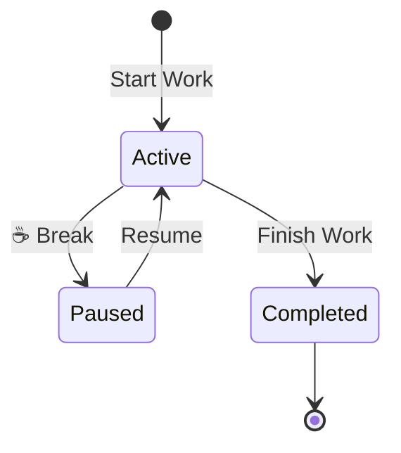

# ⏱ Модуль учёта времени (Time Tracking)

## Обзор

Модуль учёта времени обеспечивает:
- Трекинг рабочих сессий с привязкой к клиентам
- Геолокационный контроль (опционально)
- Голосовые отчёты о проделанной работе
- Расчёт заработка в реальном времени

---

## 📱 Способы учёта

### 1. Telegram Bot (основной)
```
▶️ Start Work → Выбрать клиента → Работать → ⏹️ Finish Work
```

### 2. Веб-интерфейс GTD
```
Открыть задачу → ▶ Начать сессию → ⏹ Остановить
```

### 3. Веб-интерфейс Time Tracking
```
/crm/timetracking → + Add Session
```

---

## 🔄 Жизненный цикл сессии



### Статусы

| Статус | Описание |
|--------|----------|
| `active` | Сессия активна, таймер идёт |
| `paused` | На перерыве |
| `completed` | Завершена |
| `cancelled` | Отменена |

---

## 📊 Веб-страница Time Tracking

**URL:** `/crm/timetracking`

### Функции
- Просмотр всех сессий (таблица)
- Фильтрация по сотруднику, клиенту, дате
- Редактирование сессий (для админов)
- Экспорт данных

### Колонки таблицы
```
┌────────────┬───────────┬────────────┬──────────┬─────────┬──────────┐
│ Сотрудник  │ Клиент    │ Начало     │ Конец    │ Время   │ Заработок│
├────────────┼───────────┼────────────┼──────────┼─────────┼──────────┤
│ Иван       │ ООО Альфа │ 09:00      │ 17:30    │ 8h 30m  │ $212.50  │
│ Петр       │ ИП Бета   │ 10:15      │ 14:45    │ 4h 30m  │ $90.00   │
└────────────┴───────────┴────────────┴──────────┴─────────┴──────────┘
```

---

## 🗺 Геолокация

### Как работает
1. При старте/завершении работы бот запрашивает геолокацию
2. Сравнивает с адресом клиента
3. Если расхождение > 500м — показывает предупреждение
4. Руководитель видит отклонения в отчётах

### Настройка геозон
- Адрес клиента вводится в карточке клиента
- Система автоматически геокодирует адрес
- Радиус проверки: 500 метров

---

## 🎙 Голосовые отчёты

### При старте работы
Работник записывает голосовое сообщение:
- Что планирует сделать
- Какие материалы нужны

**AI сохраняет:**
- `plannedTaskSummary` — краткое содержание
- `plannedTaskDescription` — детальное описание
- `voiceStartUrl` — ссылка на аудио

### При завершении работы
Работник записывает итоговый отчёт:
- Что сделано
- Какие проблемы возникли
- Что нужно доделать

**AI извлекает:**
- `resultSummary` — итог работы
- `issuesReported` — проблемы
- `tasks[]` — задачи на будущее (создаются в GTD)

---

## 💾 Структура данных

### WorkSession
```typescript
{
  id: string;
  
  // Участники
  userId: string;
  userName: string;
  
  // Клиент
  clientId: string;
  clientName: string;
  
  // Время
  startTime: Timestamp;
  endTime?: Timestamp;
  pausedAt?: Timestamp;
  totalPauseDuration?: number; // минуты
  
  // Финансы
  hourlyRate: number;
  totalMinutes?: number;
  totalEarnings?: number;
  
  // Связь с GTD
  relatedTaskId?: string;
  projectId?: string;
  
  // Голосовые отчёты
  plannedTaskSummary?: string;
  resultSummary?: string;
  voiceStartUrl?: string;
  voiceEndUrl?: string;
  
  // Геолокация
  startLocation?: GeoPoint;
  endLocation?: GeoPoint;
  locationMismatch?: boolean;
  
  // Фото
  startPhotoUrl?: string;
  endPhotoUrl?: string;
  
  // Статус
  status: 'active' | 'paused' | 'completed' | 'cancelled';
  
  createdAt: Timestamp;
  updatedAt: Timestamp;
}
```

---

## 🔧 Интеграция с GTD

При запуске сессии из задачи GTD:
- `relatedTaskId` связывает сессию с задачей
- Задача автоматически переходит в "In Progress"
- При завершении — обновляется время в задаче

---

## ⚙️ Автоматизация

### Firebase Functions

| Функция | Триггер | Действие |
|---------|---------|----------|
| `finalizeExpiredSessions` | Cron (каждые 6ч) | Закрывает "забытые" активные сессии |
| `checkLongBreaks` | Cron | Уведомляет о затянувшихся перерывах |
| `onWorkSessionCreate` | onCreate | Уведомляет администратора |
| `onWorkSessionUpdate` | onUpdate | Пересчитывает финансы |

---

*Обновлено: Январь 2026*
